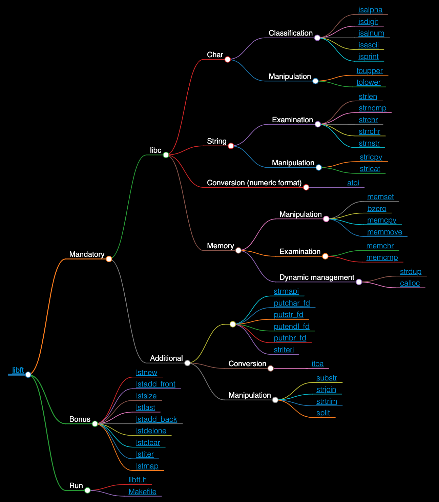

```
██╗     ██╗██████╗ ███████╗████████╗
██║     ██║██╔══██╗██╔════╝╚══██╔══╝
██║     ██║██████╔╝█████╗     ██║   
██║     ██║██╔══██╗██╔══╝     ██║   
███████╗██║██████╔╝██║        ██║   
╚══════╝╚═╝╚═════╝ ╚═╝        ╚═╝                                    
```

**Libft is a project for Standard C library override functions that should be\
done from the ground up, and must behave the same as the originals**

<!-- [](https://github.com/JaeSeoKim/badge42) -->

* **First part:** re-code a set of the **libc functions**, as defined in their man, with\
the same prototype and behaviors as the originals.
* **Second part:** code a set of *functions that are either not included in the libc*\
or included in a different form.
* **Bonus part:** code functions to manipulate **Linked Lists**.

 Skills | Grade | 
:------:|:-----:|
[Imperative programming] [Algorithms & AI] [Rigor] |  **:white_check_mark: 125%**

### *Access to the [interactive map](https://faleite.github.io/42libft).*
[](https://faleite.github.io/42libft)
